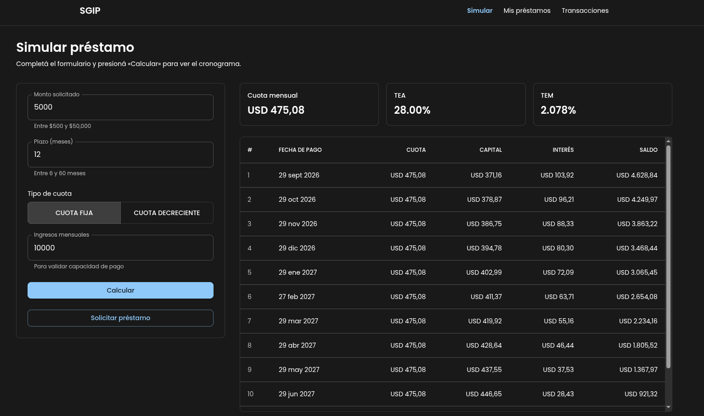
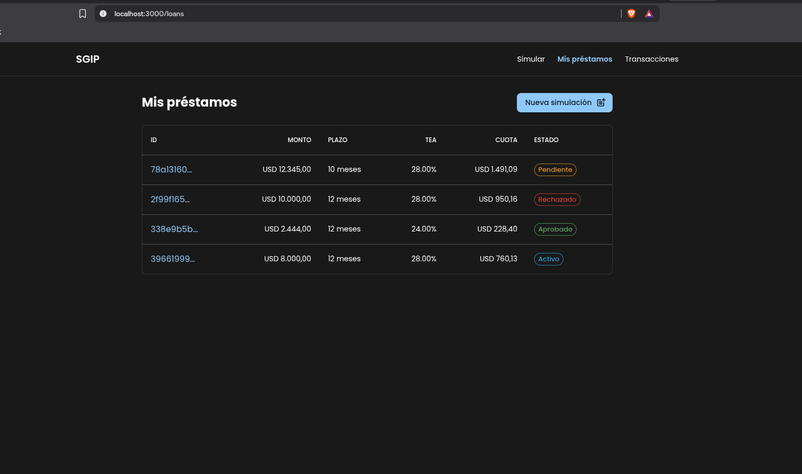
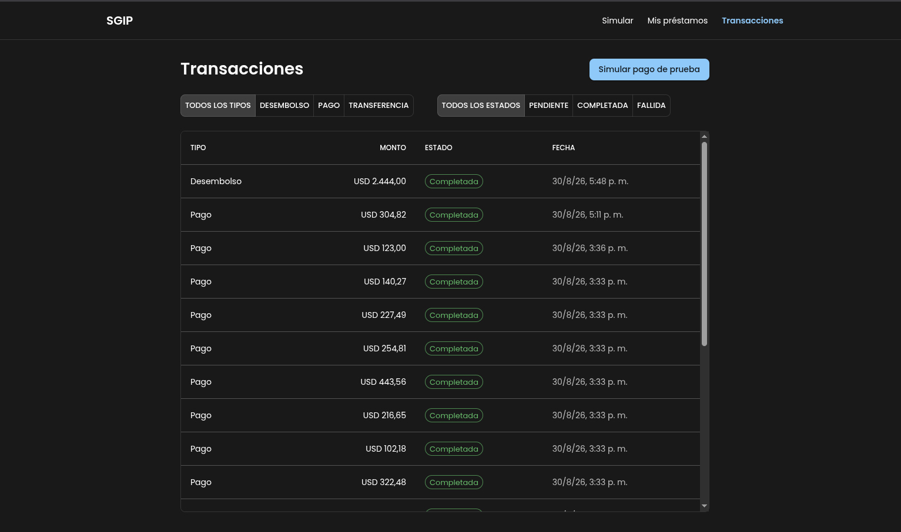

# SGIP - Sistema de Gestión de Inversiones y Préstamos

WebApp para la gestión de préstamos e inversiones con simulación y solicitud de préstamos, listado de préstamos y transacciones.

### Simulación de préstamos
- Simulación ingresando monto, plazo, tipo de cuota (fija/decreciente) e
  ingresos mensuales, con validación de campos vía React Hook Form + Zod
  antes de enviar cualquier petición.
- Resultado de la simulación: cuota mensual, TEA, TEM y cronograma completo
  (capital, interés y saldo por cuota).
- Envío de la solicitud de préstamo directamente desde el resultado de la
  simulación, sin tener que volver a cargar datos.

### Gestión de préstamos
- Listado de préstamos del usuario con su estado.
- Detalle de préstamo con cronograma completo.
- Aprobación y rechazo de préstamos pendientes.

### Gestión de transacciones
- Listado de transacciones con filtros por tipo y estado (vía query params,
  compartibles como URL).
- Botón para simular una transacción de prueba (pago), con garantía de
  idempotencia de extremo a extremo (ver [Arquitectura](#arquitectura)).

---

## Links Remotas (Producción)

| Link | Url |
|------|-----|
| Frontend | |

## Links Locales (Desarrollo)

| Link | Url |
|------|-----|
| Frontend | http://localhost:3000 |

No se requieren credenciales de prueba: la aplicación usa un `userId`
hardcodeado (`user-123`) en el frontend

---

## Tecnologías utilizadas

| Tecnología | Versión |
|------------|---------|
| Node.js | 26.1 |
| pnpm | 11.18 |
| React | 19 |
| Next.js | 16.3 |
| Material UI | 9.4 |
| @mui/Material Nextjs | 9.4 |
| React Hook Form | 7.86 |
| Zod | 4.5 |

### Decisiones técnicas

Se usó Next.js con App Router para poder aplicar un patrón **BFF** el navegador nunca llama directamente al backend,
solo el servidor de Next.js lo hace, vía Server Components para lecturas y
Server Actions para mutaciones. Material UI se eligió para tener
componentes accesibles sin construirlos desde
cero, dado el plazo de la prueba. React Hook Form + Zod se usaron para
validar formularios antes de enviar cualquier petición al backend.

---

## Instalación y configuración

- Clona el repositorio en tu máquina local.

```bash
git clone https://github.com/BrayanDennisAA/sgip-front.git

cd sgip-front
```

- Crear un archivo `.env` en la raíz del proyecto y agregar las siguientes variables de entorno:

```bash
API_URL= URL del backend (por ejemplo: http://localhost:8080)
```

- Instala las dependencias del proyecto (usar npm o pnpm según tu preferencia):

```bash
    npm install
```
- Ejecuta el proyecto en modo desarrollo:

```bash
    npm run dev
```

## Estructura del proyecto


```
sgip-front/
├── public/               # Archivos públicos (imágenes, favicon, etc.)
├── src/
│   ├── actions/          # Server Actions ("use server"): todas las mutaciones
│   │                     # (crear préstamo, aprobar, rechazar, crear transacción)
│   ├── app/               # Rutas (App Router)
│   │   ├── api/            # Único Route Handler del proyecto: BFF del simulador
│   │   │                   # en tiempo real (ver Arquitectura)
│   │   ├── loans/          # Simulador, listado y detalle de préstamos
│   │   └── transactions/   # Listado y filtros de transacciones
│   ├── components/        # Componentes de UI reutilizables (DataTable, StatusBadge, etc.)
│   ├── hooks/              # Custom hooks (useServerAction, useLoanSimulation)
│   ├── lib/                 # Constantes y utilidades sin estado (sesión hardcodeada, etc.)
│   ├── services/            # Cliente del backend .NET (fetch tipado, server-only).
│   │                         # Es la ÚNICA capa que conoce la URL del backend.
│   ├── theme/                # Tema de Material UI + registro SSR (ThemeRegistry)
│   ├── types/                 # Tipos TS que reflejan los DTOs del backend
│   └── utils/                  # Formatters puros (moneda, fechas)
├── .env                    # Variables de entorno (no versionado)
├── package.json
└── tsconfig.json
```

---
## Arquitectura

Se adoptó **Backend for Frontend (BFF)** de forma literal, no solo como
nombre: el servidor de Next.js es el único cliente HTTP del backend.
El navegador solo tiene un punto de contacto directo (`app/api/loans/simulate`),
que existe porque el simulador necesita recalcular al enviar el formulario
sin recargar la página completa — todo lo demás (listar préstamos, ver
detalle, aprobar/rechazar, crear transacciones) pasa por Server Components
o Server Actions, nunca por `fetch` del cliente hacia el backend.

### Idempotencia
 
La `Idempotency-Key` se genera en el cliente (`crypto.randomUUID()`) al
momento de que el usuario dispara una transacción, se mantiene igual si hay
que reintentar por un error de red, y viaja como header HTTP hasta el
backend — que es quien la usa para garantizar que un doble-click no cree
dos transacciones duplicadas.

### Patrones de diseño utilizados

- **BFF**: descrito arriba.
- **Custom hooks reutilizables**: `useServerAction` centraliza el manejo de
  pending/error de cualquier Server Action que siga el contrato
  `ActionResult`, evitando repetir `useTransition` + `useState` en cada
  componente que dispara una mutación.
- **Composición sobre herencia en componentes de datos**: `DataTable<T>` es
  un componente genérico (columnas + filas) reutilizado en el listado de
  préstamos, transacciones y el cronograma de pagos, en vez de tener tres
  implementaciones de tabla casi idénticas.

---

## Decisiones de diseño

- **Diseño responsive** con el sistema de grillas de Material UI.
- **Validación en dos capas, a propósito duplicada**: React Hook Form + Zod
  en el frontend (feedback inmediato, sin round-trip).
- **`server-only` en `services/`**: convierte un error de arquitectura
  (importar el cliente del backend desde un Client Component, exponiendo
  `API_URL` al bundle del navegador) en un error de build.

### Trade-offs

- No se implementó autenticación ni autorización.

- No se usó estado global (Redux/Zustand): con Server Components haciendo
  la mayoría de las lecturas, el estado de cliente que queda es acotado a
  formularios puntuales, y `useState`/`useTransition` locales alcanzan sin
  agregar una dependencia más.

- Los límites de negocio (monto, plazo) están duplicados entre el
  validador de Zod en el frontend y en el backend. Es una
  fuente potencial de desincronización si el negocio cambia esos número.

## Supuestos y limitaciones
 
- Sin autenticación: `userId` hardcodeado en `lib/session.ts`.
- Sin tests automatizados de frontend.
- Los límites de negocio están duplicados en frontend y backend un cambio de negocio requiere tocar ambos lados.
- El simulador solo recalcula al enviar el formulario (botón «Calcular»),
  no en cada tecla — decisión deliberada para evitar peticiones
  innecesarias mientras el usuario todavía está completando los campos.


## Mejoras Futuras

- Implementar autenticación y autorización de usuarios para garantizar que solo los usuarios autorizados puedan acceder a ciertas funcionalidades.
- Agregar pruebas unitarias y de integración para garantizar la calidad y estabilidad del código.
- Mejorar la experiencia de usuario mediante la implementación de animaciones y transiciones suaves en la interfaz.
- Implementar una arquitectura modular y escalable que permita agregar nuevas funcionalidades de manera eficiente.

## Mejoras futuras
 
- Autenticación y autorización de usuarios.
- Tests de hooks y de los Server Actions más críticos (idempotencia,
  aprobación de préstamos).
- Animaciones/transiciones en cambios de estado (aprobación, envío de
  solicitud).
- Centralizar los límites de negocio en un único origen de verdad
  (ej. exponerlos desde el backend vía un endpoint de configuración, en
  vez de duplicarlos en el schema de Zod).


## Evidencia

### Simulación de Préstamos



### Listado de Préstamos



### Transacciones



---
Autor: Brayan Dennis Aguilar Aparicio